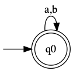
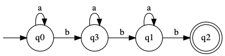
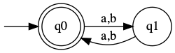
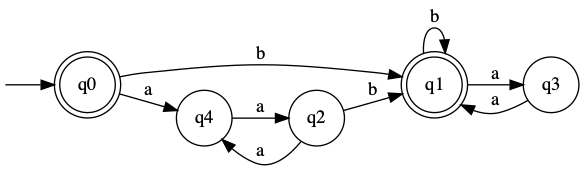

# Regex to DFA convertor

- This repo is to create the minimal DFA for a given regex in two symbols (a,b) and using the operators: concat, kleene_star and union along with parentheses. 

- Flex-Bison is used to parse the regex and convert it to NFA (with epsilon transitions) which is then converted to DFA using subset-construction and then to the minimal DFA.

- To visualise the DFA, the code for DFA in GraphViz format is generated and svg code for the graph is obtained using webscrapping (selenium) and then finally converted to dfa.png and displayed.

## Usage

### Prerequisites
- Python 3.x, C++20, Flex-Bison, Make
    - Python Libraries:  Selenium, CairoSVG

### Steps
1. Clone the repository:
   ```bash
   git clone https://github.com/your-username/your-repo-name.git
2. Navigate to project directory:
    ```bash
   cd repo
3. Run the bash script:
    ```bash
   bash run.sh
4. The final dfa image will be opened using an image viewer.

## Inputs
The input follows the following grammar:
<pre>
1. Input → Regex
2. Regex → Regex Regex 
3.         | Regex '*' 
4.         | Regex '|' Regex
5.         | '(' Regex ')'
6.         | 'a' | 'b' 
</pre>

### Sample Inputs
<pre>
(a|b)*
a*ba*ba*b
(ab|ba|aa|bb)*
((aa)*b(bb)*(aa)*)*
</pre>

## Outputs
Here are some of the output DFAs for the sample input regexes in order.
1. `(a|b)*` <br> <br>

2. `a*ba*ba*b` <br> <br>

3. `(ab|ba|aa|bb)*` <br> <br>

4. `((aa)*b(bb)*(aa)*)*` <br> <br>


## Acknowlegements
- This repo was originated as a compiler design assignment to parse regexes.
- The DFA image is generated from [GraphvizOnline](https://dreampuf.github.io/GraphvizOnline)
- Contributors: [Kumaresan045](https://github.com/Kumaresan045)
